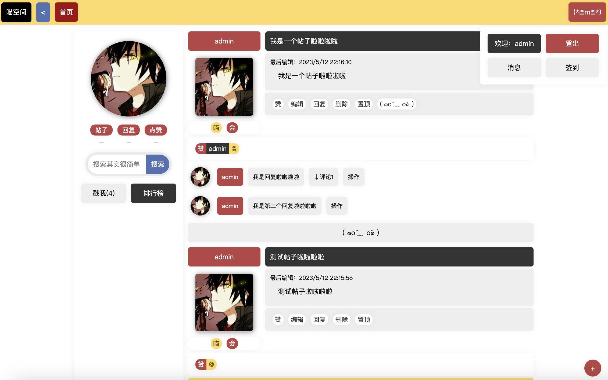
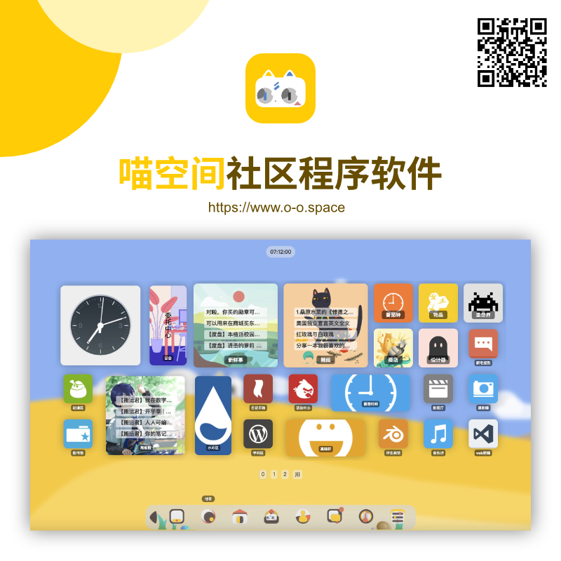

# icat_bbs_mini 喵空间社区程序迷你版
a cut mini bbs/forum. 一个一点也不可爱的迷你轻论坛/轻社区程序？

# 使用说明
下载项目后，进入项目目录
打开命令行：
1. npm install安装依赖
2. 修改./config/config.js里的相关配置信息，你需要安装mysql，新建数据库，并配置好用户权限
3. node serve.js启动服务

启动后，根据命令行给出的地址，在本地浏览器里就可以访问啦
如果需要服务器启动，你需要绑定域名并配置反向代理哦
具体可以参考网络上的文章

有不懂的问题可以前往文末的社区交流哈

# 开发相关
这是一个前后端都使用javaScript开发的项目
前端：mithril.js
后端:hapi.js、sequelize等

# 关于
这是一个mini版程序，程序交流可以前往：
https://www.o-o.space/#!/home/6475
